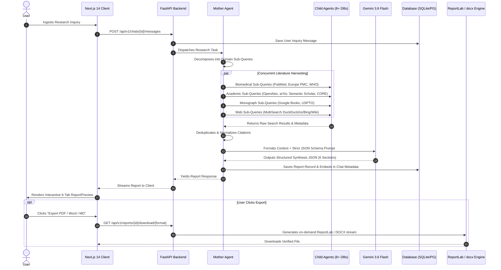

# ResearchAI: Comprehensive Technical Architecture & Workflow Blueprint

## Executive Abstract
**ResearchAI** is an enterprise-grade distributed scientific intelligence and multi-agent synthesis platform. Rather than relying on a single generalist LLM prompt, ResearchAI employs a hierarchical multi-agent architecture with a centralized orchestrator (**Mother Agent**) and four specialized domain agents (**Biomedical**, **Academic Literature**, **Monographs & Patents**, and **Web/News**). The system concurrently queries **8+ global scholarly and public databases**, cross-verifies empirical claims, normalizes citation networks, and generates publication-quality analytical intelligence reports across multiple formats (Interactive Web UI, PDF, DOCX, Markdown, HTML).

---

## 1. Full Technology Stack & System Infrastructure

```
┌─────────────────────────────────────────────────────────────────────────────┐
│                          NEXT.JS 14 FRONTEND CLIENT                         │
│  • React 18 (Server & Client Components) • TailwindCSS • Lucide Icons      │
│  • Zustand Reactive Stores (Auth, Chat, Streaming, Reports)                │
│  • Interactive 6-Tab ReportPreview • Real-Time Citation Cards               │
└──────────────────────────────────────┬──────────────────────────────────────┘
                                       │ HTTP / JSON / SSE Streams
                                       ▼
┌─────────────────────────────────────────────────────────────────────────────┐
│                           FASTAPI REST BACKEND API                          │
│  • FastAPI (Python 3.12+) • Uvicorn ASGI Server • Pydantic v2 Models        │
│  • Async Database Sessions (SQLAlchemy ORM) • Dependency Injection          │
└──────────────┬───────────────────────┬───────────────────────┬──────────────┘
               │                       │                       │
               ▼                       ▼                       ▼
┌─────────────────────────┐ ┌────────────────────┐ ┌─────────────────────────┐
│   DATABASE & STORAGE    │ │     LLM BRAIN      │ │    SECURITY & AUTH      │
│ • SQLite (Async Engine) │ │ • Google Gemini    │ │ • 3-Layer Compound Hash │
│ • PostgreSQL (Prod)     │ │   3.6 Flash        │ │ • Google OAuth 2.0 PKCE │
│ • Redis Cache & Revoke  │ │ • 8,192 Max Tokens │ │ • JWT 256-Bit HS256     │
└─────────────────────────┘ └────────────────────┘ └─────────────────────────┘
               │
               ▼
┌─────────────────────────────────────────────────────────────────────────────┐
│                HIERARCHICAL MULTI-AGENT ORCHESTRATION ENGINE                │
│                         Mother Agent (Orchestrator)                         │
│       ┌───────────────┬───────────────┼───────────────┬───────────────┐     │
│       ▼               ▼               ▼               ▼               ▼     │
│ [Academic Agent] [Biomedical]    [Books/Patents] [Web Scraper]   [Synthesis]│
│ • OpenAlex       • PubMed/NCBI   • Google Books  • DuckDuckGo    • Gemini   │
│ • arXiv          • Europe PMC    • USPTO Patents • Wikipedia     • Consensus│
│ • Semantic Schol • WHO IRIS      • Policy Repos  • Bing/Archive  • Citations│
│ • CORE & DOAJ                                                               │
└─────────────────────────────────────────────────────────────────────────────┘
```

### Granular Infrastructure Components

| Subsystem | Technology / Library | Granular Role & Implementation Details |
|---|---|---|
| **Frontend UI / Client** | Next.js 14 (App Router) + React 18 + TailwindCSS | Server/Client components, responsive dark/light styling, interactive 6-tab ReportPreview, streaming message parser, and export trigger handlers. |
| **State Management** | Zustand (TypeScript Stores) | Reactive client stores for auth session (`authStore`), chat streaming (`chatStore`), bookmark management, and report state synchronization. |
| **Backend REST API** | FastAPI 0.115+ + Uvicorn + Pydantic v2 | Asynchronous non-blocking ASGI server, strict Pydantic model validation, dependency injection, and automatic OpenAPI schema generation. |
| **LLM Brain** | Google Gemini 3.6 Flash (`google-generativeai`) | Primary neural reasoning engine with 8,192 token output capacity, sub-query decomposition, literature evaluation, and structured JSON synthesis. |
| **Database & ORM** | SQLAlchemy 2.0 (Async/Sync) + SQLite / PostgreSQL | Asynchronous database sessions (`AsyncSession`), UUID primary keys, soft-deletion mixins, relationship cascades, and connection pooling. |
| **Distributed Cache & Security** | Redis 7+ / In-Memory Fallback Cache | Sliding-window IP rate limiting, JWT refresh token revocation storage, query deduplication caching, and distributed worker pub/sub. |
| **PDF Generation Engine** | ReportLab 5.0.1 (Pure Python Engine) | Custom two-pass `NumberedCanvas` (Page X of Y), fluid paragraphs avoiding table splitting issues, running headers/footers, and clean typography. |
| **Document Exports** | `python-docx` + `markdown2` | Automated generation of styled Microsoft Word `.docx` documents with table borders, formatted Markdown `.md`, and standalone HTML files. |
| **Mail Dispatcher** | Python `smtplib` + Gmail SMTP (App Password) | Asynchronous welcome emails and notification dispatch with styled HTML templates and background task execution. |
| **Security Layer** | `bcrypt` + `python-jose` (HS256) + `cryptography` | 3-Layer compound password hashing (HMAC-SHA512 + SHA-256 + 12-round Bcrypt), JWT access/refresh token pairs, and PKCE OAuth 2.0. |

---

## 2. End-to-End Multi-Agent Research Workflow



---

## 3. Integrated Scholarly & Academic Databases (8+ Engines)

| Database / Source | Coverage Scope | API Protocol & Rate Optimization | Extracted Metadata Fields |
|---|---|---|---|
| **OpenAlex** | 250M+ cross-disciplinary publications, authors, institutions | REST API with polite email pool rate acceleration | Title, abstract, DOI, publication date, cited-by count, open access URL |
| **PubMed / NCBI** | 35M+ biomedical, life science, and clinical trial studies | NCBI E-utilities API (`esearch` + `esummary` JSON/XML) | PMID, authors, journal title, study type, full abstract, MeSH terms |
| **arXiv** | 2M+ preprints in Physics, Mathematics, CS, Quantitative Biology | arXiv API Atom/XML query parsing | arXiv ID, title, summary, authors, primary category, PDF link |
| **Semantic Scholar** | 200M+ academic literature with AI-extracted summaries | Semantic Scholar Academic Graph REST API v1 | PaperId, title, TLDR summary, citation count, influential citations |
| **Europe PMC** | 40M+ life sciences articles, PMC full texts, preprints | Europe PMC RESTful Web Service | pmcid, journal, publication year, citedByCount, author details |
| **CORE & DOAJ** | Global open access research repositories and journals | CORE API v3 & DOAJ Search API | Repository link, full text download link, peer review status |
| **Google Books** | Monographs, foundational textbooks, academic volumes | Google Books Volumes REST API with Cloud API Key | Book title, authors, publisher, publishedDate, preview link |
| **MultiSearch Web** | DuckDuckGo, Wikipedia, Bing, Internet Archive, Mojeek | Aggregated MultiSearch fallback scraper integration | Snippet, source title, web URL, page summary |

---

## 4. Enterprise Cryptographic Security Architecture

### 3-Layer Compound Password Hashing (Defense-in-Depth)

Unlike standard systems that rely on a single password hash, ResearchAI implements a **3-layer compound transformation**:

```
                         User Plain Password
                                  │
                                  ▼
      ┌────────────────────────────────────────────────────────┐
      │ Layer 1: HMAC-SHA512 with Server Secret Pepper         │
      │ • Keyed with backend SECRET_KEY                        │
      │ • Eliminates rainbow table precomputation              │
      │ • Removes bcrypt's 72-byte truncation limitation       │
      └───────────────────────────┬────────────────────────────┘
                                  │ 512-bit digest
                                  ▼
      ┌────────────────────────────────────────────────────────┐
      │ Layer 2: SHA-256 Intermediate State Entropy Digest     │
      │ • Normalizes entropy across byte distributions         │
      │ • Masks raw HMAC internal state                        │
      └───────────────────────────┬────────────────────────────┘
                                  │ 256-bit digest
                                  ▼
      ┌────────────────────────────────────────────────────────┐
      │ Layer 3: Adaptive Salted Bcrypt (12 Work Rounds)       │
      │ • 4,096 cost iterations (GPU/ASIC-resistant)           │
      │ • Unique per-user random cryptographic salt            │
      └───────────────────────────┬────────────────────────────┘
                                  │
                                  ▼
           Stored in Database: $multi$v1$$2b$12$...
```

### Authentication & Token Flow
1. **Google OAuth 2.0**: Direct token exchange via Google Identity Services with PKCE and state protection.
2. **Dual JWT Tokens**: 60-minute short-lived `access_token` for API authorization + 7-day `refresh_token` stored in Redis with revocation checks on `/auth/logout`.
3. **Brute-Force Rate Limiting**: IP-based rate limiting on registration (5 attempts/hour) and login endpoints with constant-time comparison (`bcrypt.checkpw`).
4. **Zero-Secret Leakage**: All keys, database files, and tokens are strictly excluded from version control via `.gitignore`.

---

## 5. Report Synthesis & Multi-Format Document Generation

### 6-Tab Structured Intelligence Report
The Gemini 3.6 Flash synthesis engine parses retrieved evidence into 6 structured sections:
1. **Executive Summary & Foundational Context**: High-density briefing with methodology verification protocols.
2. **Empirical Findings**: Numbered technical findings, quantitative metrics, key takeaway pills, and supporting evidence tags.
3. **In-Depth Thematic Analysis**: Granular examination of underlying mechanisms, trade-offs, and systemic impacts.
4. **Evidence Matrix & Comparative Stances**: Multi-dimensional comparison of contrasting scientific perspectives and benchmarks.
5. **Conclusions, Limitations & Strategic Roadmap**: Consensus milestones, methodological constraints, and high-impact future directions.
6. **Scholarly Bibliography**: Complete numbered APA-style reference list with title, author, year, venue, and clickable DOI/URLs.

### Document Generation Engine (`report_service.py`)
- **PDF Generation (ReportLab 5.0.1)**: Employs a custom two-pass `NumberedCanvas` that counts exact total pages, running headers on pages 2+, left-accented emerald callout boxes, and flowing paragraphs that eliminate blank page gaps.
- **Word (.docx) Generation (`python-docx`)**: Generates native XML headings, custom callout tables, and styled bulleted lists.
- **Markdown (.md) & HTML (.html)**: Clean semantic markdown AST and standalone responsive HTML with embedded CSS styling.

---

## 6. Email Dispatch & Automated Notification Pipeline

- **Email Service (`email_service.py`)**:
  - Integrated with Gmail SMTP (`smtp.gmail.com:587`) using TLS encryption and App Passwords.
  - Asynchronous non-blocking dispatch via `asyncio.to_thread` ensuring API response latency is zero.
  - Dispatches branded HTML welcome notifications and account confirmations immediately upon registration and Google OAuth sign-up.

---

## 7. Project File & Directory Organization

```
researchai/
├── README.md                               # Project overview & quickstart
├── RESEARCHAI_ARCHITECTURE.md              # Detailed technical architecture blueprint
├── ResearchAI_Architecture_and_Workflow_Overview.pdf # Executive PDF document
├── docker-compose.yml                      # Full-stack container orchestration
├── .gitignore                              # Comprehensive secret & build file exclusion
├── backend/
│   ├── .env.example                        # Template environment variables
│   ├── requirements.txt                    # Python dependencies
│   ├── Dockerfile                          # Backend container definition
│   └── app/
│       ├── main.py                         # FastAPI application entrypoint & middleware
│       ├── api/
│       │   ├── deps.py                     # Current user authentication dependencies
│       │   └── v1/
│       │       ├── auth.py                 # Login, register, Google OAuth & token routes
│       │       ├── chat.py                 # Chat stream & message management routes
│       │       ├── reports.py              # Report retrieval & export download routes
│       │       └── workspace.py           # User bookmarks & statistics routes
│       ├── agents/
│       │   ├── mother_agent.py             # Mother orchestrator agent
│       │   └── child/
│       │       ├── base_agent.py           # Abstract child agent interface
│       │       ├── academic_agent.py       # OpenAlex, arXiv, Semantic Scholar, CORE
│       │       ├── medical_agent.py        # PubMed, Europe PMC, WHO IRIS
│       │       ├── books_agent.py          # Google Books, USPTO Patents
│       │       └── web_agent.py            # MultiSearch Web Aggregator
│       ├── core/
│       │   ├── config.py                   # Pydantic environment configuration
│       │   ├── database.py                 # SQLAlchemy async engine & sessionmaker
│       │   ├── security.py                 # 3-Layer multi-hashing & JWT token logic
│       │   └── redis.py                    # Redis cache & rate limiting helpers
│       ├── integrations/                   # Individual API connector modules
│       ├── models/                         # SQLAlchemy ORM database models
│       ├── schemas/                        # Pydantic request/response schemas
│       └── services/
│           ├── auth_service.py             # User registration & OAuth service
│           ├── chat_service.py             # Message & chat session service
│           ├── email_service.py            # SMTP email dispatch service
│           └── report_service.py           # ReportLab PDF, DOCX, MD, HTML generator
└── frontend/
    ├── package.json                        # Node.js dependencies
    ├── tailwind.config.ts                  # Tailwind theme configuration
    └── src/
        ├── app/
        │   ├── layout.tsx                  # Root layout & typography
        │   ├── (auth)/
        │   │   ├── login/page.tsx          # Minimal high-security login page
        │   │   └── register/page.tsx       # Registration with password strength meter
        │   └── (dashboard)/
        │       ├── chat/[id]/page.tsx      # Interactive research workspace
        │       ├── reports/page.tsx        # Generated reports library
        │       └── bookmarks/page.tsx      # Saved research citations
        ├── components/
        │   ├── auth/GoogleAuthButton.tsx   # Google OAuth 2.0 button component
        │   ├── chat/                       # Streaming messages, input & citations
        │   ├── reports/ReportPreview.tsx   # 6-Tab enterprise report viewer
        │   └── layout/                     # Sidebar, header & navigation
        └── stores/                         # Zustand reactive state stores
```
