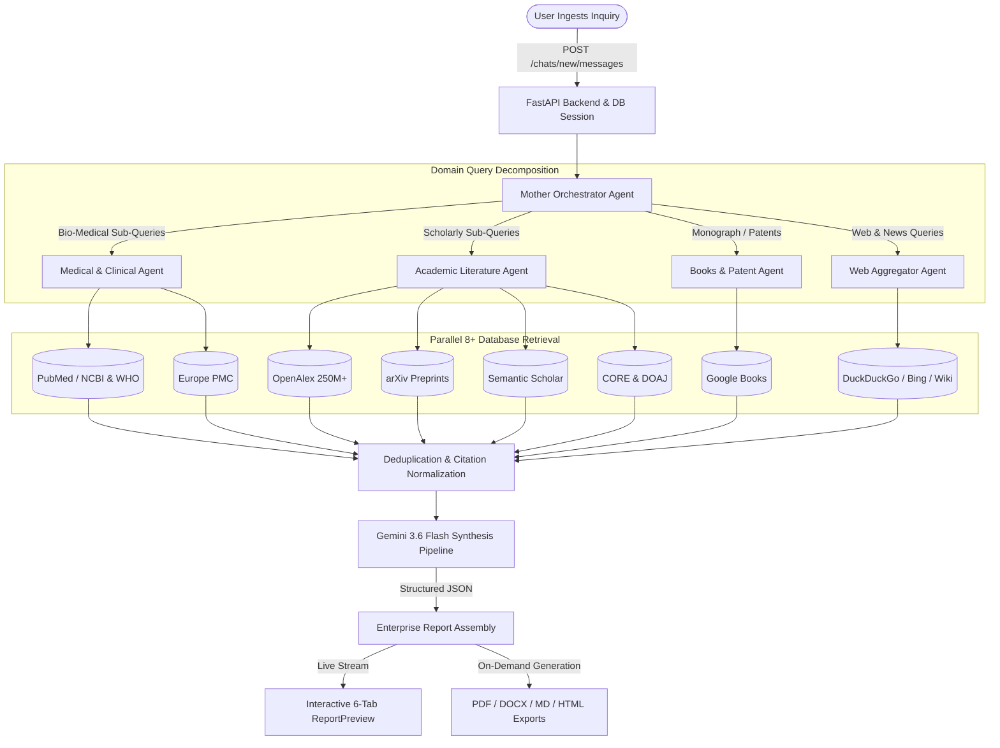

# ResearchAI: Technical Architecture & Workflow Specifications

## Executive Summary
**ResearchAI** is an enterprise-grade scientific intelligence and multi-agent synthesis platform. It orchestrates specialized autonomous child agents to concurrently query over 8 academic, medical, and public databases, cross-verify empirical claims, calculate confidence and consensus metrics, and generate publication-quality analytical intelligence reports.

---

## 1. Technology Stack & Infrastructure

| Layer / Component | Technology / Framework | Function & Purpose in ResearchAI |
|---|---|---|
| **Frontend UI / Client** | Next.js 14 (App Router) + React 18 + TailwindCSS + Lucide Icons | Interactive streaming dashboard, 6-tab enterprise report viewer, real-time citation cards, and export handlers. |
| **Backend Framework** | FastAPI (Python 3.12+) + Uvicorn + Pydantic v2 | High-performance asynchronous REST API with dependency injection, strict validation, and CORS protection. |
| **LLM Synthesis Engine** | Google Gemini 3.6 Flash (High Quota, 8,192 token window) | Deconstructs research inquiries into sub-queries, evaluates literature, and generates structured JSON synthesis. |
| **Relational Database** | SQLAlchemy ORM + SQLite / PostgreSQL | Persistent storage for users, chats, message history, agent execution logs, and full synthesized reports. |
| **Distributed Cache & Security** | Redis / In-Memory Fallback Cache | JWT refresh token revocation storage, IP brute-force rate-limiting, and query deduplication cache. |
| **Document Generation** | ReportLab 5.0 + python-docx + markdown | On-demand streaming exports to multi-page PDF with `NumberedCanvas`, Word (.docx), Markdown, and HTML. |
| **Mail Dispatch** | Python smtplib + Gmail SMTP (App Password) | Asynchronous HTML welcome notifications and account status emails upon registration and OAuth sign-in. |

---

## 2. End-to-End Multi-Agent Workflow

---

## 3. Integrated Scholarly & Academic Databases

1. **OpenAlex**: 250M+ cross-disciplinary papers, citation counts, concepts, and author institutions.
2. **PubMed / NCBI**: 35M+ biomedical, clinical trials, and life sciences journals.
3. **arXiv**: 2M+ preprints in Physics, Mathematics, Computer Science, and Quantitative Biology.
4. **Semantic Scholar**: 200M+ academic literature with AI-extracted TLDRs and influential citation graphs.
5. **Europe PMC**: 40M+ life science articles, PubMed Central full texts, and preprint repositories.
6. **CORE & DOAJ**: Millions of open access research papers and peer-reviewed journals.
7. **Google Books & Custom Search**: Monographs, foundational textbooks, and indexed web publications.
8. **MultiSearch Web Aggregator**: DuckDuckGo, Wikipedia, Bing, Internet Archive, and Mojeek.

---

## 4. Security & Cryptographic Architecture

- **3-Layer Compound Password Hashing**:
  - `Layer 1`: `HMAC-SHA512` with server-side private secret pepper.
  - `Layer 2`: `SHA-256` state entropy digest (eliminates bcrypt's 72-byte truncation limitation).
  - `Layer 3`: `12-Round Adaptive Salted Bcrypt` (GPU-resistant key stretching).
- **Google OAuth 2.0 Identity**: Secure token exchange via Google Identity Services with PKCE and state protection.
- **JWT Session Tokens**: 60-minute Access Tokens with Redis token revocation on logout.
- **Brute-Force Rate Limiting**: IP rate-limiting on authentication endpoints with timing-safe comparisons.
- **Safe Secret Isolation**: All keys, database files, and tokens are strictly excluded from version control via `.gitignore`.
